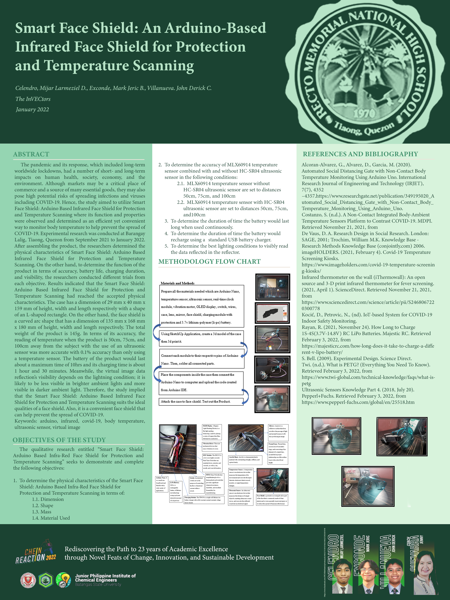

# Arduino Smart Face Shield (2022)

  

## Introduction

This project is my Senior High Practical Research 2 Scientific Investigatory Project (SIP), in which it was completed on January 2022. It was developed as a response to the COVID-19 pandemic, aimed at improving public health safety. Our Arduino-based smart face shield was designed to provide a hands-free solution for temperature scanning and monitoring.

The smart face shield detects the temperature of surrounding individuals without any physical contact, offering a fast and effective way to monitor for potential fever—a common symptom of COVID-19. This device not only helps in minimizing close contact but also ensures a quick and efficient method to assess temperatures in public spaces.

This project utilizes an Arduino with an ultrasonic sensor and an infrared temperature sensor to measure both the distance and the temperature of a person. The values are displayed on an OLED screen which the user can view through a reflection, and a vibration motor is triggered if the temperature exceeds a certain threshold (37.5°C). The project also includes a real-time clock (RTC) module to display the current date and time on the OLED display.

## Components
- **Arduino Nano** (for portability)
- **Ultrasonic Sensor (HC-SR04)**: Measures distance in centimeters.
- **Infrared Temperature Sensor (MLX90614)**: Measures object and ambient temperature.
- **OLED Display (128x64)**: Displays date, time, temperature, and distance.
- **Vibration Motor**: Activated when the object's temperature exceeds 37.5°C.
- **RTC Module (DS3231)**: Displays the current date and time.
- **Additional Power Supply Pin (VCC2)**: Supplies power to the ultrasonic sensor.

## Libraries Used
You need to install the following libraries in your Arduino IDE:
- [NewPing](https://bitbucket.org/teckel12/arduino-new-ping/wiki/Home): For the ultrasonic sensor.
- [Adafruit MLX90614](https://github.com/adafruit/Adafruit-MLX90614-Library): For the infrared temperature sensor.
- [Adafruit GFX](https://github.com/adafruit/Adafruit-GFX-Library): For controlling the OLED display.
- [Adafruit SSD1306](https://github.com/adafruit/Adafruit_SSD1306): For the OLED screen communication.
- [RTClib](https://github.com/adafruit/RTClib): For the real-time clock module.

## Features

  

- **Distance Measurement**: Measures the distance using the ultrasonic sensor.
- **Temperature Measurement**: Measures the object's temperature using the MLX90614 sensor.
- **OLED Display**: Displays the current date, time, temperature, and distance.
- **Vibration Alert**: The vibration motor is activated if the object's temperature is equal to or above 37.5°C.
- **Real-Time Clock (RTC)**: Shows the current date and time using the DS3231 module.

## How It Works

  

1. The ultrasonic sensor detects the distance to an object in centimeters.
2. The infrared temperature sensor measures an object temperature.
3. The current date and time are fetched from the RTC module.
4. If the measured object temperature is greater than or equal to 37.5°C, the vibration motor is triggered.
5. All the data (date, time, distance, temperature) is displayed on the OLED screen which is reflected through a mirror into a transparent surface.
6. The data is also printed to the Serial Monitor for debugging purposes.

## Circuit Diagram
Make sure to connect the following components correctly:

- **Ultrasonic Sensor (HC-SR04)**:
  - Trigger pin to Arduino pin 11
  - Echo pin to Arduino pin 12
  - VCC to Arduino 5V (or additional 5V pin)
  - GND to Arduino GND
- **Infrared Temperature Sensor (MLX90614)**:
  - SDA to Arduino A4
  - SCL to Arduino A5
  - VCC to Arduino 3.3V
  - GND to Arduino GND
- **OLED Display (SSD1306 128x64)**:
  - SDA to Arduino A4
  - SCL to Arduino A5
  - VCC to Arduino 5V
  - GND to Arduino GND
- **RTC (DS3231)**:
  - SDA to Arduino A4
  - SCL to Arduino A5
  - VCC to Arduino 5V
  - GND to Arduino GND
- **Vibration Motor**:
  - Vibration motor pin to Arduino pin 10
  - Ground pin to GND

## Code
You can find the source code in the `asf.ino` file. The main logic involves the following:
- Initialization of all sensors and the OLED screen.
- Continuously fetch and display the date, time, temperature, and distance.
- Activate the vibration motor based on the temperature threshold.

## How to Use
1. **Upload the code** to your Arduino board using the Arduino IDE.
2. **Install the required libraries** in your Arduino IDE if you haven't already.
3. **Connect the components** according to the circuit diagram.
4. Open the **Serial Monitor** to view the real-time data output.
5. Observe the **OLED display** for real-time distance, temperature, date, and time.
6. If the temperature exceeds 37.5°C, the vibration motor will be activated.
7. Once working, print all the parts from [assets folder](https://github.com/kramikkk/arduino-smart-face-shield/tree/main/case-3d-model) and place the components inside it.

## Poster

## Extra
[Smart-Face-Shield-Research-Paper.pdf](https://github.com/kramikkk/arduino-smart-face-shield/tree/main/assets/Smart-Face-Shield-Research-Paper.pdf) 
## License
This project is licensed under the MIT License. You are free to use, modify, and distribute this project as long as proper credit is given to the author.
